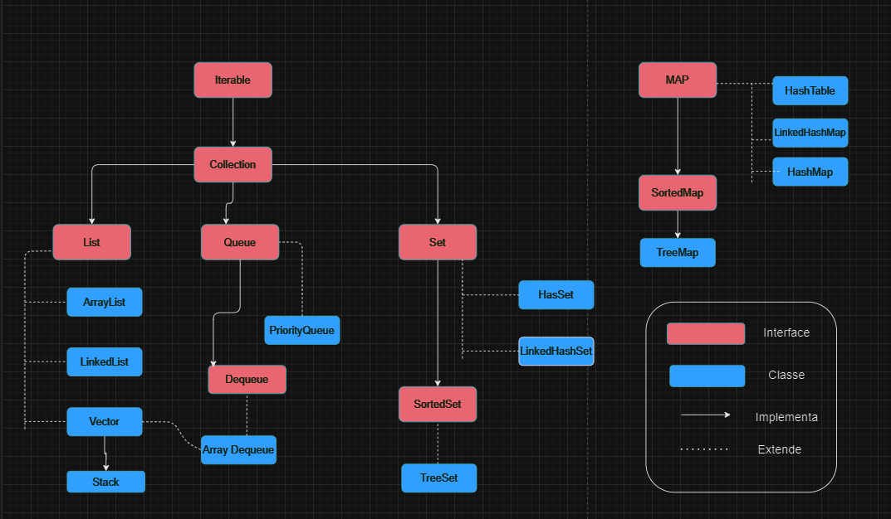

# Collection Framework API

- Uma coleção (collection) é uma estrutura de dados que serve para agrupar muitos elementos em uma única unidade, estes elementos precisão ser Objetos.

## Hierarquia Collection

### List

- A interface ``list`` e uma coleção ordenada que permite a inclusão de elementos duplicados

- É um dos tipos de coleção mais utilizados no java, e as classes de implementação comum são ``LinkedList`` e ``ArrayList``

- A interface ``List`` se assemelha a uma matriz com o comprimento dinâmico, permitindo adicionar ou remover elementos.

- A interface ``List`` fornece métodos úteis para adicionar elementos em posição específicas, remover ou substituir elementos com base no índice e obter sublistas usando índices.

- A classe ``Collections`` fornece algoritmos úteis para a manipulação de List, como ordenação(sort),embaralhamento(shuffle) e reversão(reverse) e busca binária(binarySearch)

### Set

- A interface ``Set`` é uma coleção que não pode conter elementos duplicados

- Essa interface representa o conecito matematico de conjunto e é usada para representar conjuntos, como baralho de cartas.

- A plataforma java possui **3 implementações** para ``Set`` de uso geral: ``HashSet``, ``TreeSet``, ``LinkedHashSet``

- A interface ``Set`` não permite acesso aleatórioa um elemnto na coleção

- Para percorrer os elementos de um ``Set``, você pode usar um Iterador ou um loop foreach